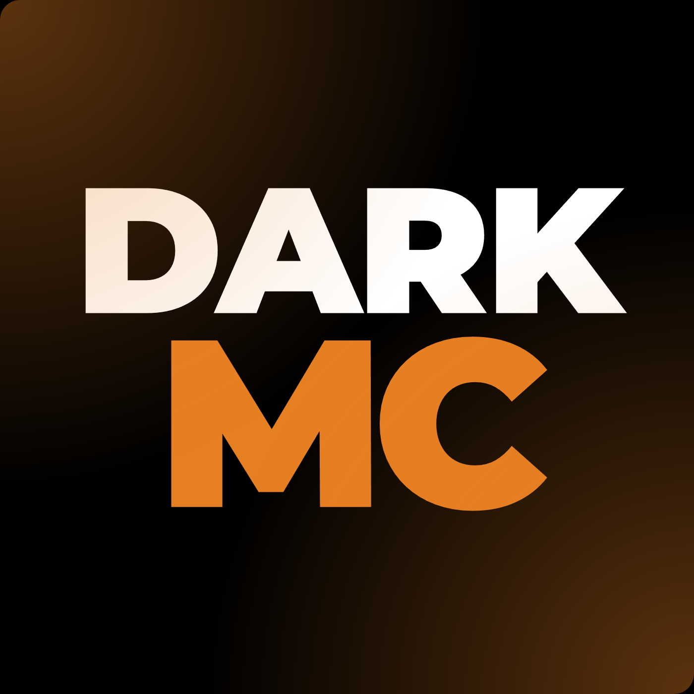
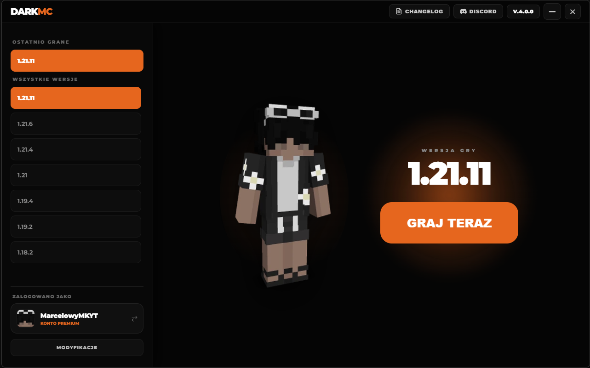
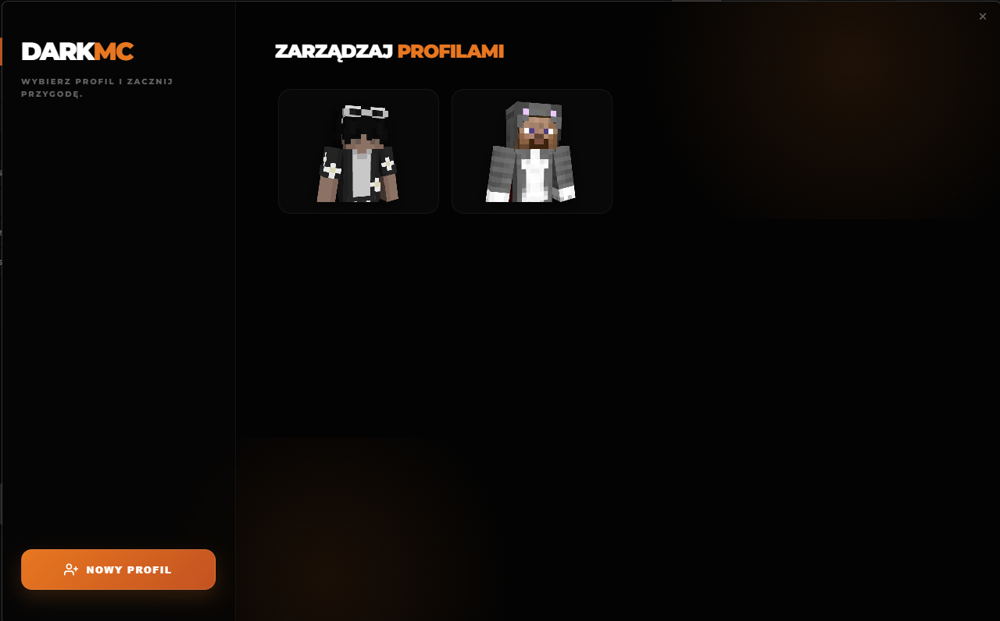
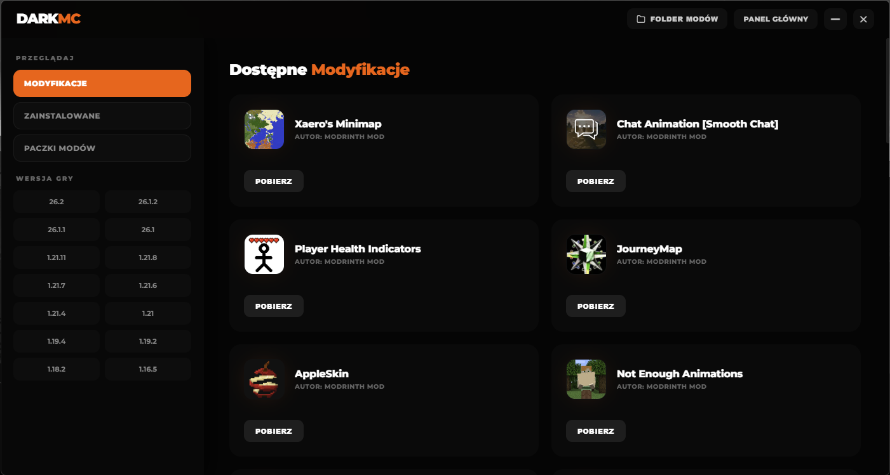

  
  

  # DarkMC Launcher
  
  *Nowoczesny, lekki i intuicyjny launcher do Minecrafta z mrocznym motywem graficznym, interaktywnym podglądem postaci oraz wbudowanym menedżerem wersji.*

   

  

 

# Galeria

Poniżej znajdują się zrzuty ekranu prezentujące interfejs DarkMC:

## Strona Główna

## Zarządzanie Profilami

## Menu Modyfikacji

---

## Cechy i Funkcje Launchera

- **Interaktywny podgląd skina:** W centrum ekranu znajduje się trójwymiarowa wizualizacja Twojej postaci w grze.
- **Wygodne wybieranie wydań:** Szybki dostęp do ostatnio granych wersji oraz pełna lista wspieranych wydań Minecrafta (od starszych po najnowsze, np. 1.18.2 - 1.21.11).
- **Zarządzanie kontem:** Wyświetlanie statusu gracza (np. Konto Premium), nazwy użytkownika oraz awatara z opcją szybkiej zmiany konta.
- **Menu Modyfikacji:** Dedykowana sekcja pozwalająca na łatwą konfigurację i zarządzanie modami.
- **Integracja społecznościowa:** Szybkie odnośniki do dziennika zmian (Changelog) oraz oficjalnego serwera Discord w górnym panelu.

---

## Instalacja i Uruchomienie

1. Przejdź do zakładki Releases lub kliknij fioletowy przycisk **Pobierz** umieszczony na samej górze.
2. Pobierz najnowszy plik wykonywalny launchera.
3. Uruchom aplikację – DarkMC sprawdzi spójność plików, zweryfikuje aktualizację i przygotuje grę do uruchomienia.